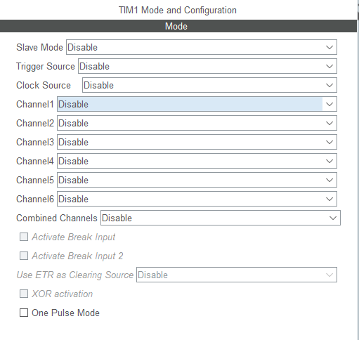
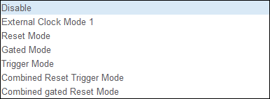

版权信息

:::warning

本文章为博主原创文章。遵循 [CC 4.0 BY-SA](https://creativecommons.org/licenses/by-sa/4.0/deed.zh-hans) 版权协议，转载请附上原文出处链接和本声明。

:::

---

## 1. 目录
- [1. 目录](#1-目录)
- [2. 说明](#2-说明)
- [3. TIM 各种模式详解](#3-tim-各种模式详解)
	- [3.1. 从模式](#31-从模式)
		- [3.1.1. 简介](#311-简介)
		- [3.1.2. 复位模式（RM）](#312-复位模式rm)
		- [3.1.3. 门控模式（GM）](#313-门控模式gm)
		- [3.1.4. 触发模式（TM）](#314-触发模式tm)
		- [3.1.5. 外部时钟模式1](#315-外部时钟模式1)
		- [3.1.6. 一个示例](#316-一个示例)
		- [3.1.7. 参考](#317-参考)
	- [3.2. 编码器模式](#32-编码器模式)
	- [3.3. 触发源](#33-触发源)
	- [3.4. 时钟源](#34-时钟源)
	- [3.5. 主模式](#35-主模式)
		- [3.5.1. 比较与捕获](#351-比较与捕获)
	- [3.6. 一些疑惑的地方](#36-一些疑惑的地方)
		- [3.6.1. Q：`output compare no output`是什么模式？好矛盾的名字。。。](#361-qoutput-compare-no-output是什么模式好矛盾的名字)
		- [3.6.2. Q：输出比较和PWM生成模式有何区别与联系？](#362-q输出比较和pwm生成模式有何区别与联系)
		- [3.6.3. Q：何为强制输出？有啥用？](#363-q何为强制输出有啥用)
			- [3.6.3.1. 强制输出模式的工作原理：](#3631-强制输出模式的工作原理)
			- [3.6.3.2. 主要功能：](#3632-主要功能)
			- [3.6.3.3. 工作模式：](#3633-工作模式)
			- [3.6.3.4. 例子：](#3634-例子)
			- [3.6.3.5. 总结：](#3635-总结)
		- [3.6.4. Q：输入捕获的间接模式？](#364-q输入捕获的间接模式)
			- [3.6.4.1. 特点：](#3641-特点)
			- [3.6.4.2. 以下是直接与非直接模式的比较](#3642-以下是直接与非直接模式的比较)
		- [3.6.5. 参考](#365-参考)

## 2. 说明

本文以STM32G4系列为例。供自己学习与记录且只做简单介绍。有一定基础的朋友可参考。

--- 

## 3. TIM 各种模式详解

如下为一个高级定时器的配置页面

### 3.1. 从模式

可配置功能

#### 3.1.1. 简介

定时器的从模式控制器可以对计数器实现哪些控制或影响呢？从模式控制器检测到触发输入信号时，可以对定时器进行如下操作而控制或影响计数器的工作：

1. 对计数器复位
2. 启动或停止计数器的计数动作
3. 使能计数器模块的工作
4. 通过触发信号为计数器提供时钟源

#### 3.1.2. 复位模式（RM）

主定时器出现信号后：从定时器计数器复位并产生一个中断。

不妨以计数器向上计数为例，将它配置在复位从模式。比方说当计数器计数到某个数据的时候，来了个触发信号，计数器不再继续往上计数，而是重新归0后开始计数。当然，计数器的实际复位操作与触发沿之间往往会有个小的延时，这是由于触发信号作为有效触发脉冲的话，还需要经过定时器内的同步电路确认。

关于处于复位模式下的定时器，有两点提醒：

1. 只要有复位触发脉冲出现，计数器就会被复位重置。复位次数取决于触发脉冲次数。
2. 工作在复位模式下的定时器，其使能需靠软件代码实现，即使能定时器的CEN@TIMx_CR1位。

#### 3.1.3. 门控模式（GM）

主定时器出现信号后：从定时器计数器开始工作

主定时器信号结束后：从定时器计数器停止工作并产生中断

#### 3.1.4. 触发模式（TM）

主定时器出现信号后：从定时器计数器开始工作，并且不会停止。

触发模式主定时器只是提供了一个启动从定时器开始时间的控制，并不会有其他效果，触发从模式下，触发信号具有相当于软件使能计数器的作用，即置位CEN@TIMx_CR1，这也是它最大最明显的特征。

#### 3.1.5. 外部时钟模式1

外部时钟模式1从模式比较特别，当计数器的时钟源来自触发信号时，此时定时器就工作在外部时钟1从模式，此时触发信号扮演着双角色，即**触发信号**与**时钟信号**。

比如，我们可以使用来自ETR脚的滤波信号ETRF作为触发信号并担当计数器的时钟源。

#### 3.1.6. 一个示例

Q：开启两个定时器，定时器2与定时器3，均作pwm输出，定时器3的pwm输出跟随定时器2的pwm输出。
如何做才能又准又稳定还不占用cpu资源？

大致思路：定时器2的ch2输出，并将ch2的OC2REF作为从定时器3的TRGO，并通过主从对应表，找到相应的ITRx，当出现上升沿或下降沿时，会触发从定时器的开启。应将定时器3配置为触发模式（Trigger Mode）

#### 3.1.7. 参考

- 👍👍👍[【话说定时器系列】之三：STM32定时器的信号触发与主从模式-电子工程世界](https://news.eeworld.com.cn/mcu/ic634774.html)
- [stm32定时器从模式解析_stm32定时器主从模式-CSDN博客](https://blog.csdn.net/weixin_44748127/article/details/123726458)

### 3.2. 编码器模式

对于编码器模式，它是针对编码器应用的一个特定从模式，应用时注意使用定时器的通道1、通道2引进编码器脉冲，这里不赘述。

### 3.3. 触发源

结合原理图，我们可以知道定时器可由触发源触发启动。

### 3.4. 时钟源

分为内部时钟和外部触发（外界其他信号源），不再赘诉。

### 3.5. 主模式

这是通道1的可配置功能：

细讲一下
#### 3.5.1. 比较与捕获

捕获

什么是捕获？

所谓捕获就是通过检测捕获通道上的边沿信号。在边沿信号发生跳变（比如上升沿/下降沿）的时候，将当前定时器的值(TIMx_CNT)存放到对应的通道的捕获/比较寄存器(TIMx_CCR)里面，完成一次捕获。

STM32支持一下捕获模式：

1. 输入捕获模式
2. PWM输入模式

输入捕获模式可以用来测量脉冲宽度或者测量频率。下图是输入捕获测量高电平脉宽的原理，假定定时器工作在向上计数模式，图中 t1~t2 时间，就是需要测量的高电平时间。

测量方法如下：首先设置定时器通道x为上升沿捕获，这样，t1 时刻，就会捕获到当前的 CNT 值，然后立即清零 CNT，并设置通道x下降沿捕获，这样到 t2 时刻，又会发生捕获事件，得到此时的 CNT 值，记为CCRx2。这样，根据定时器的计数频率，我们就可以算出 t1~t2 的时间，从而得到高电平脉宽。

比较

什么是比较？

所谓比较就是计数器的值和与装载的值进行比较，**和外部的信号没关系**。

STM32支持一下比较模式：

1. 强制输出模式
2. 输出比较模式
3. **PWM模式**
4. 单脉冲模式

### 3.6. 一些疑惑的地方

#### 3.6.1. Q：`output compare no output`是什么模式？好矛盾的名字。。。

A：`Output Compare No Output`意味着该定时器的输出比较（Output Compare）功能已经启用，但它不会实际输出到引脚上。具体来说，定时器的输出比较功能通常是用来生成定时信号（比如 PWM 或捕获信号）。如果你选择`Output Compare No Output`，这表示：

1. **输出比较功能启用**：定时器仍然会根据设置的比较值（比如定时器计数器和比较寄存器的匹配）产生一个事件。
2. **不输出到引脚**：虽然比较功能可以触发中断或设置状态，但是并没有配置定时器的输出引脚（比如一个 PWM 信号）去响应这些事件。这种配置适用于只需要定时器功能（比如触发中断）而不需要具体的硬件输出。

`Output Compare No Output`就是配置定时器的输出比较功能，不去生成实际的引脚信号，可能只是用来**触发事件**或**控制中断**。

#### 3.6.2. Q：输出比较和PWM生成模式有何区别与联系？

A：输出比较（Output Compare）和 PWM 生成模式（PWM Generation Mode）虽然都依赖于定时器的输出比较功能，但它们的应用场景和工作方式有所不同。下面是它们之间的主要区别与联系：

| **模式**    | **输出比较（Output Compare）**     | **PWM 生成模式（PWM Generation Mode）**                 |
| --------- | ---------------------------- | ------------------------------------------------- |
| **基本概念**  | 计数器的值与预设比较值比较，匹配时产生事件。       | 基于输出比较功能，周期性地生成脉宽调制（PWM）信号。计数器与比较值的关系决定引脚状态（高或低）。 |
| **作用**    | 设置引脚状态或触发中断                  | 根据计数器值与比较值的关系周期性改变引脚状态。                           |
| **用途**    | 触发定时器事件，控制外部硬件信号（如设置引脚为高或低）。 | 控制电机、LED亮度调节、电源管理等应用，需要调节占空比。                     |
| **典型应用**  | 定时脉冲、事件触发、精确的定时控制            | 电机控制、LED亮度调节、信号调制                                 |
| **周期性输出** | 否，输出比较通常产生单次信号或事件，不是周期性的。    | 是，生成周期性的波形。                                       |
| **倾向目标**  | 生成事件（如中断）。                   | 生成周期性的波形信号。                                       |

简而言之，输出比较更注重事件的触发，而PWM生成模式则专注于产生持续的周期性波形。

#### 3.6.3. Q：何为强制输出？有啥用？

A：强制输出模式（Forced Output Mode）是定时器的一种特殊输出控制模式，主要用于在定时器的某些条件下强制改变输出引脚的状态（例如设置为高或低）。这种模式可以在定时器产生的输出信号之外，强制控制引脚的状态。

##### 3.6.3.1. 强制输出模式的工作原理：

在强制输出模式下，定时器的输出信号不再完全依赖于定时器计数器和比较寄存器的常规操作（比如在 PWM 或输出比较模式下的信号波形）。你可以通过某些特定的条件或命令直接控制输出引脚的状态。例如，定时器可以在特定时刻将引脚强制设置为高或低状态。
	
##### 3.6.3.2. 主要功能：

- **强制设置输出引脚的状态**：在某些情况下，强制输出模式可以被用来直接控制输出引脚的状态，而无需依赖于定时器的正常计数和比较过程。
- **安全控制和复位功能**：强制输出模式有时用于一些安全或复位操作，比如在硬件故障时通过强制输出信号来重置系统，或在特定条件下确保引脚处于某一状态。
- **特定场景下的信号生成**：有时，强制输出模式被用来生成短暂的脉冲或特殊的状态，通常用于外部硬件的控制。

##### 3.6.3.3. 工作模式：

- **定时器强制输出高或低**：当定时器处于强制输出模式时，可以通过强制命令直接控制输出引脚状态，例如强制输出引脚保持高电平或低电平。
- **常用的应用**：这种模式常用于一些特殊的信号要求，如在系统发生异常时通过定时器引脚来输出一个特定信号，以触发外部硬件或进行故障诊断。

##### 3.6.3.4. 例子：

在某些微控制器中，定时器的强制输出模式可以与“输出比较模式”结合使用，当定时器进入强制输出模式时，它会直接设置输出引脚为高或低，而不再受定时器的常规计数和比较值的控制。可以通过特定的触发条件或外部信号来激活强制输出模式，这通常用于控制需要在系统中立即做出响应的应用场景。**（通过软件切换）**

##### 3.6.3.5. 总结：

强制输出模式就是在特定情况下，强制定时器的输出引脚为高或低电平，忽略定时器的常规输出信号，常用于特殊的应用需求，如系统故障处理、硬件复位、特殊信号生成等。

#### 3.6.4. Q：输入捕获的间接模式？

A：间接模式较为复杂，捕获事件并不直接与计数器挂钩，而是通过某些条件或外部事件来触，具体来说，这种模式可能涉及定时器的某些附加功能（例如外部触发事件或特定的输入滤波器），这些功能可能会延迟捕获事件的实际记录。

##### 3.6.4.1. 特点：

- **间接捕获**：输入信号的变化并不是直接影响计数器，而是需要某些附加的条件或触发事件来保存捕获值。
- **较复杂的控制逻辑**：非直接模式**可以结合更多外部事件和触发条件来决定何时捕获信号**，因此适用于更复杂的应用场景。
- **滤波和去抖动**：非直接模式可以配合外部触发信号或滤波功能，适用于噪声较大的环境。

##### 3.6.4.2. 以下是直接与非直接模式的比较

| 特性        | 直接模式（Direct Mode）          | 非直接模式（Indirect Mode）    |
| --------- | -------------------------- | ----------------------- |
| **捕获方式**  | 信号变化直接触发捕获，捕获值立即存储         | 信号变化通过触发事件或附加条件触发捕获     |
| **触发条件**  | 外部输入信号（上升沿/下降沿）直接触发捕获      | 外部事件、触发器或滤波器控制捕获事件的触发   |
| **响应速度**  | 快速（通常实时捕获）                 | 相对较慢，可能需要额外条件来触发捕获      |
| **应用场景**  | 适用于高频信号的实时捕获（如频率测量、脉冲宽度测量） | 适用于需要外部事件触发的场景，如外部信号同步等 |
| **实现复杂度** | 简单，通常是硬件层面直接实现             | 需要额外的硬件配置和控制（如触发、滤波）    |

#### 3.6.5. 参考

- 👍👍👍ChatGPT
- 👍👍👍[STM32-一文搞懂通用定时器捕获/比较通道-电子工程世界](https://news.eeworld.com.cn/mcu/ic565151.html)
